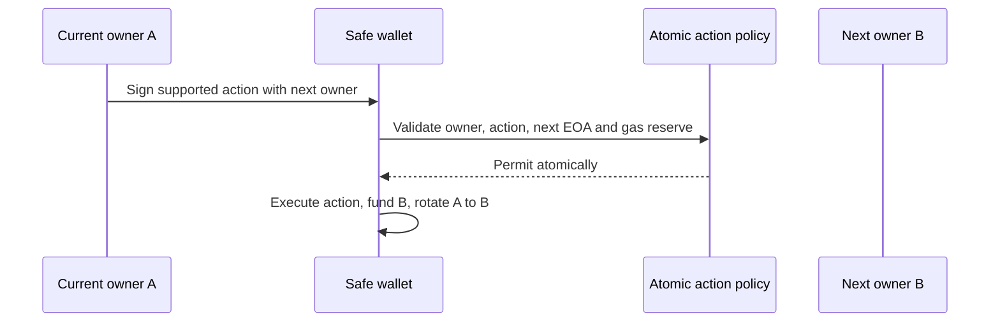
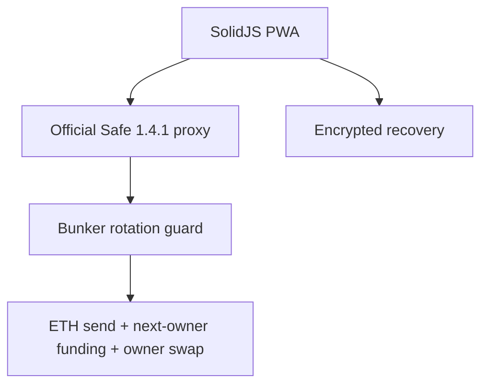

# Bunker Wallet

Bunker Wallet is a **local-first simulation** of one stable Ethereum address whose ECDSA owner advances after every supported action. Its optional unaudited Ethereum Sepolia mode deploys an official Safe 1.4.1 proxy with Bunker’s fixed-sequence rotation guard. Mainnet is disabled. Do not use meaningful funds.

ECDSA public keys become visible when an account signs. A future cryptanalytic break could make historically exposed keys more valuable targets. Bunker narrows that exposure by coupling a supported action and fresh-owner rotation in one atomic wallet operation. It is not “quantum-safe”: the pending transaction exposes a signature before confirmation, browser seed theft defeats rotation, and Ethereum still uses ECDSA.



## Current alpha

Working today:

- faucet-free local preview by default; the Ethereum Sepolia UI remains disabled pending funded live-smoke evidence;
- an ETH-send flow that atomically rotates to a fresh owner;
- visible stable address, contract balance, rotation index and session activity;
- polished offline-capable SolidJS PWA;
- 24-word BIP-39 creation and recovery confirmation;
- optional Argon2id + AES-256-GCM encrypted local vault;
- seed-only mode with no plaintext persistence;
- domain-separated fixed 20-owner commitment utilities;
- bounded, versioned file envelopes with strict validation and tamper checks;
- loopback-only Bun validation service with no key or broadcast ability;
- research guard source targeting official Safe contracts 1.4.1.

Blocked today:

| Integration | Status |
|---|---|
| Browser-HD creation and encrypted backup | Alpha |
| Ledger / Trezor | Disabled; physical testing required |
| Manual injected wallets | Disabled; proof-of-control design unresolved |
| Offline file validation | Alpha; not offline-verified |
| QR exchange | Deferred |
| Ethereum Sepolia Safe | Implemented but unaudited; browser-driven deployment |
| Production/mainnet Safe | Disabled pending independent audit |
| Ethereum mainnet | Runtime rejected |

## Future roadmap (not implemented)

- **Private transaction submission / protected relay:** evaluate private builder or relay submission to reduce public-mempool visibility of pending ECDSA signatures and exposed public keys during rotation. This would not hide them from the selected relay, builders or validators, or from the eventual chain, and it would not make Bunker quantum-safe. Relay trust, censorship and leakage risks, fallback behavior, and the complete integration require review and audit before this can be enabled.

## Architecture



See [architecture](docs/architecture.md), [threat model](docs/threat-model.md), [security decisions](docs/security-decisions.md), and [security status](SECURITY_STATUS.md).

## Storage choices

**Try local preview** creates a hidden in-memory BIP-39 mnemonic and derives its stable preview address at `m/44'/60'/7331'/1'/0'` and simulated owners at fully hardened BIP-32 path `m/44'/60'/7331'/2'/index'`, with no RPC, faucet, broadcast, or persistent keys. **Ethereum Sepolia is currently disabled** pending a funded live smoke test; its implementation creates a memory-only setup key, verifies official Safe deployments, then atomically deploys and guards a Safe proxy before funding it. Refresh loses quick-setup access. Recovery-phrase setup provides deterministic owner recovery; record the Safe address alongside the phrase.

**Encrypted local vault** derives a 256-bit key with Argon2id and uses a fresh AES-GCM nonce. **Seed phrase only** persists nothing and requires re-entry after reload. Neither mode protects an unlocked phrase from compromised page code, extensions, the browser, or OS. JavaScript cannot guarantee secure erasure.

## Offline workflow

The online coordinator will eventually export exact Safe state and calldata. The current alpha validates bounded demonstration files only. An offline-capable cached PWA is not automatically offline-verified or air-gapped. See [offline signing](docs/offline-signing.md).

## Development

Requires Bun 1.3.14.

```bash
bun install --frozen-lockfile
bun run dev
bun run typecheck
bun test
bun run build
bun run contract:compile
bun run contract:test
# With a Sepolia-forked Anvil node on port 8545:
bun run safe:smoke
bun run dependency:report
bun run release:verify
```

The static site builds to `apps/web/dist`, ready for Cloudflare Pages. The local validator binds only to `127.0.0.1`:

```bash
bun run relayer
```

The guard and one-shot setup helper compile with pinned solc 0.8.24 against vendored official Safe 1.4.1 sources. Foundry integration tests execute atomic proxy setup and guarded rotation locally. Independent audit, expanded fuzzing, and a funded restricted-value Sepolia smoke test remain mandatory before broader use.

## Security model and recovery

The fixed batch has 20 future owners; the final transition is reserved to avoid silent exhaustion. There is no dynamic refill or emergency bypass. Recover with the exact seed/device and metadata, then reconcile the active owner from authenticated chain state. Without recovery material, access may be permanently lost.

See [SECURITY.md](SECURITY.md) for responsible disclosure. Mainnet release is a separate decision requiring an independent review, verified deployments, reproducible evidence, and restricted-value testing.

## License

MIT. Safe contracts retain their upstream license.
