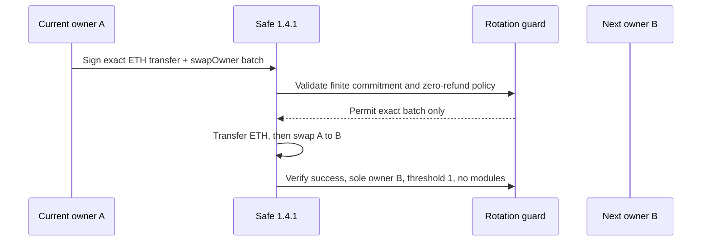
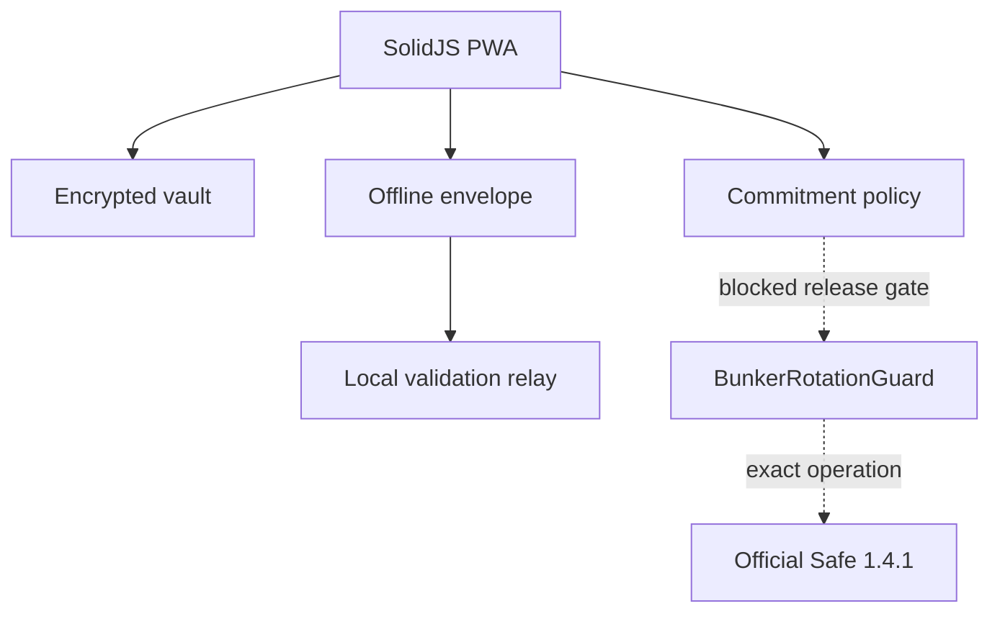

# Bunker Wallet

Bunker Wallet is an **unaudited local/testnet alpha** exploring Safe accounts that atomically advance to a precommitted fresh ECDSA owner after every supported ETH transfer. Mainnet is disabled. Do not use meaningful funds.

ECDSA public keys become visible when an account signs. A future cryptanalytic break could make historically exposed keys more valuable targets. Bunker narrows that exposure by coupling a supported action and fresh-owner rotation in one guarded Safe operation. It is not “quantum-safe”: the pending transaction exposes a signature before confirmation, browser seed theft defeats rotation, and Ethereum still uses ECDSA.



## Current alpha

Working today:

- one-click, memory-only Sepolia burner creation with a Google Cloud faucet handoff and balance refresh;
- polished offline-capable SolidJS PWA;
- 24-word BIP-39 creation and recovery confirmation;
- optional Argon2id + AES-256-GCM encrypted local vault;
- seed-only mode with no plaintext persistence;
- domain-separated fixed 20-owner commitment utilities;
- bounded, versioned file envelopes with strict validation and tamper checks;
- loopback-only Bun validation service with no key or broadcast ability;
- research guard source targeting official Safe contracts 1.4.1.

Blocked today:

| Integration | Status |
|---|---|
| Browser-HD creation and encrypted backup | Alpha |
| Ledger / Trezor | Disabled; physical testing required |
| Manual injected wallets | Disabled; proof-of-control design unresolved |
| Offline file validation | Alpha; not offline-verified |
| QR exchange | Deferred |
| Safe deployment, signing, broadcasting | Disabled pending real integration tests and audit |
| Ethereum mainnet | Runtime rejected |

## Architecture



See [architecture](docs/architecture.md), [threat model](docs/threat-model.md), [security decisions](docs/security-decisions.md), and [security status](SECURITY_STATUS.md).

## Storage choices

**Quick Sepolia burner** creates a random key in the current tab, copies its address, and opens the Google Cloud faucet. It is lost on refresh, is not backed up, and cannot sign or send in this alpha.

**Encrypted local vault** derives a 256-bit key with Argon2id and uses a fresh AES-GCM nonce. **Seed phrase only** persists nothing and requires re-entry after reload. Neither mode protects an unlocked phrase from compromised page code, extensions, the browser, or OS. JavaScript cannot guarantee secure erasure.

## Offline workflow

The online coordinator will eventually export exact Safe state and calldata. The current alpha validates bounded demonstration files only. An offline-capable cached PWA is not automatically offline-verified or air-gapped. See [offline signing](docs/offline-signing.md).

## Development

Requires Bun 1.3.14.

```bash
bun install --frozen-lockfile
bun run dev
bun run typecheck
bun test
bun run build
bun run contract:compile
bun run dependency:report
bun run release:verify
```

The static site builds to `apps/web/dist`, ready for Cloudflare Pages. The local validator binds only to `127.0.0.1`:

```bash
bun run relayer
```

The guard compiles with pinned solc 0.8.24 against vendored official Safe 1.4.1 sources. Foundry is not installed in the implementation environment; real Safe/Anvil execution, fuzzing, atomic bootstrap, and independent audit remain mandatory before deployment.

## Security model and recovery

The fixed batch has 20 future owners; the final transition is reserved to avoid silent exhaustion. There is no dynamic refill or emergency bypass. Recover with the exact seed/device and metadata, then reconcile the active owner from authenticated chain state. Without recovery material, access may be permanently lost.

See [SECURITY.md](SECURITY.md) for responsible disclosure. Mainnet release is a separate decision requiring an independent review, verified deployments, reproducible evidence, and restricted-value testing.

## License

MIT. Safe contracts retain their upstream license.
