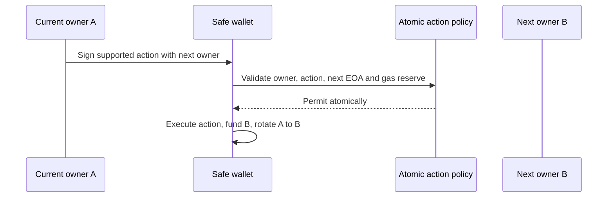
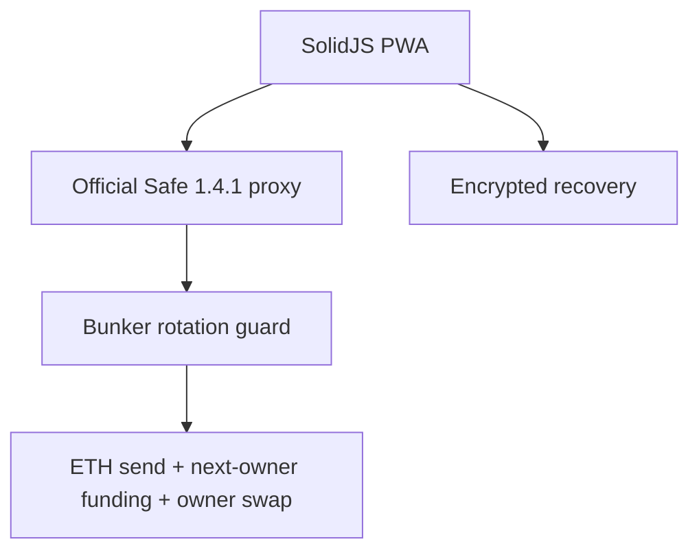

# Bunker Wallet

Bunker Wallet is a **local-first simulation** of one stable Ethereum address whose ECDSA owner advances after every supported action. Its optional unaudited Ethereum Sepolia mode deploys an official Safe 1.4.1 proxy with Bunker’s fixed-sequence rotation guard. Mainnet is disabled. Do not use meaningful funds.

ECDSA public keys become visible when an account signs. A future cryptanalytic break could make historically exposed keys more valuable targets. Bunker narrows that exposure by coupling a supported action and fresh-owner rotation in one atomic wallet operation. It is not “quantum-safe”: the pending transaction exposes a signature before confirmation, browser seed theft defeats rotation, and Ethereum still uses ECDSA.



## Current alpha

Working today:

- faucet-free local simulation plus a live, unaudited Sepolia testnet flow at `https://bunker.supplies` and `https://sepolia-test.bunker-wallet.pages.dev`; Test ETH only—never use mainnet ETH or meaningful funds;
- an ETH-send flow that atomically rotates to a fresh owner;
- visible stable address, contract balance, rotation index and session activity;
- polished offline-capable SolidJS PWA;
- 24-word BIP-39 creation and recovery confirmation;
- optional Argon2id + AES-256-GCM encrypted local vault;
- seed-only mode with no plaintext persistence;
- domain-separated fixed 20-owner commitment utilities;
- bounded, versioned file envelopes with strict validation and tamper checks;
- loopback-only Bun validation service with no key or broadcast ability;
- research guard source targeting official Safe contracts 1.4.1.

Blocked today:

| Integration | Status |
|---|---|
| Browser-HD creation and encrypted backup | Alpha |
| Ledger / Trezor | Disabled; physical testing required |
| Manual injected wallets | Disabled; proof-of-control design unresolved |
| Offline file validation | Alpha; not offline-verified |
| QR exchange | Deferred |
| Ethereum Sepolia Safe | Live restricted-value testnet alpha; deploy, ETH send, owner rotation and recovery validated; independent audit required |
| Production/mainnet Safe | Disabled pending independent audit |
| Ethereum mainnet | Runtime rejected |

## Remaining roadmap (not implemented)

- independent review of the guard, atomic setup, browser transaction construction, recovery, persistence and runtime attestation;
- expanded parser, signature-boundary, replacement, storage-attestation and reentrancy fuzz/property testing;
- a reviewed owner-sequence refill or migration before the nineteenth ordinary rotation—no emergency bypass;
- physical Ledger and Trezor validation before hardware signing support;
- **private transaction submission / protected relay:** evaluate private builder or relay submission to reduce public-mempool visibility of pending ECDSA signatures and exposed public keys during rotation. This would not hide them from the selected relay, builders or validators, or from the eventual chain, and it would not make Bunker quantum-safe;
- mainnet, meaningful-funds use, arbitrary calls, modules, refunds and production relaying remain disabled.

### Live Sepolia testnet

`https://bunker.supplies` and `https://sepolia-test.bunker-wallet.pages.dev` support browser recovery, official Safe deployment, and ETH-only sends using disposable Sepolia test ETH. The flow is unaudited, may be reset without notice, and must never receive mainnet ETH or meaningful assets. Ethereum mainnet remains disabled.

1. Select **Create Wallet (Testnet)**.
2. Back up and confirm the 24-word recovery phrase.
3. Protect the browser with an optional password or browser-bound non-extractable device key.
4. Fund the displayed setup key with at least **0.03 Sepolia ETH**.
5. Create the guarded Safe wallet, then send ETH and rotate its owner atomically.

## Architecture



See [architecture](docs/architecture.md), [threat model](docs/threat-model.md), [security decisions](docs/security-decisions.md), and [security status](SECURITY_STATUS.md).

## Storage choices

**Try It (Simulation)** creates a hidden in-memory BIP-39 mnemonic and derives its stable preview address at `m/44'/60'/7331'/1'/0'` and simulated owners at fully hardened BIP-32 path `m/44'/60'/7331'/2'/index'`, with no RPC, faucet, broadcast, or persistent keys. **Create Wallet (Testnet)** requires recovery-phrase setup, verifies official Safe deployments, then atomically deploys and guards a Safe proxy before funding it. Record the stable Safe address alongside the phrase; there is no recovery backend.

**Encrypted local vault** is the opt-in persistent browser-wallet mode: it derives a 256-bit key with Argon2id, uses a fresh AES-GCM nonce, and stores only the encrypted envelope in `localStorage`. The password is cleared after use. A saved wallet survives refreshes and browser restarts using AES-GCM ciphertext and a non-extractable WebCrypto key in IndexedDB; **Lock** or cleared site data requires the vault password or recovery phrase again. Compromised same-origin code, extensions, the browser profile, or OS can still use an unlocked wallet. Passwordless setup uses the same browser-bound encrypted device record and still requires the 24-word phrase on another device. Neither mode protects an unlocked phrase from compromised page code, extensions, the browser, or OS. JavaScript cannot guarantee secure erasure.

## Offline workflow

The online coordinator will eventually export exact Safe state and calldata. The current alpha validates bounded demonstration files only. An offline-capable cached PWA is not automatically offline-verified or air-gapped. See [offline signing](docs/offline-signing.md).

## Development

Requires Bun 1.3.14.

```bash
bun install --frozen-lockfile
bun run dev
bun run typecheck
bun test
bun run build
bun run contract:compile
bun run contract:test
# With a Sepolia-forked Anvil node on port 8545:
bun run safe:smoke
# Local-only, explicitly gated live runners; never run in CI:
# bun run safe:sepolia:e2e
# bun run safe:sepolia:browser-e2e
bun run dependency:report
bun run release:verify
```

The static site builds to `apps/web/dist`, ready for Cloudflare Pages. The local validator binds only to `127.0.0.1`:

```bash
bun run relayer
```

The guard and one-shot setup helper compile with pinned solc 0.8.24 against vendored official Safe 1.4.1 sources. Current checks include 27 Bun tests, 7 Foundry integration tests, a local Safe deployment/rotation smoke, a restricted live Sepolia deploy/send/two-rotation/recovery smoke, and gated browser lifecycle and persistence checks. The browser flow was validated with controlled test recipients; ENS resolution is tested separately. Independent audit and expanded fuzz/property testing remain mandatory before broader use.

## Security model and recovery

The fixed batch has 20 committed owners and permits 19 ordinary rotations; the final transition is reserved to avoid silent exhaustion. There is no reviewed refill/migration path or emergency bypass. Hosted actions are limited to recipient ETH send, exact next-owner funding and owner swap; arbitrary calls, modules and refunds are rejected. Recover with the exact seed/device and metadata, then reconcile the active owner from authenticated chain state. Without recovery material, access may be permanently lost.

See [SECURITY.md](SECURITY.md) for responsible disclosure. Mainnet release is a separate decision requiring an independent review, verified deployments, reproducible evidence, and restricted-value testing.

## License

MIT. Safe contracts retain their upstream license.
