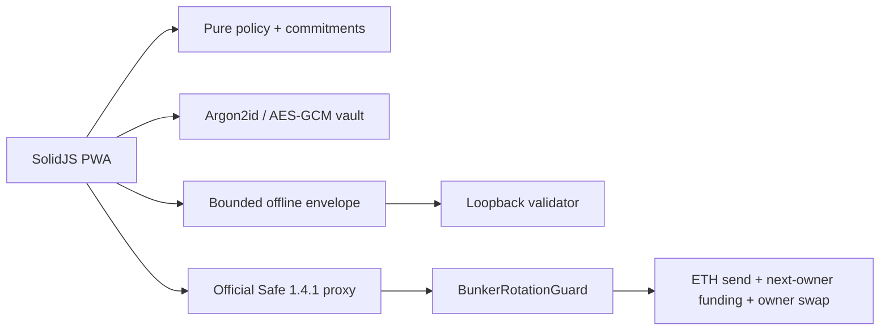

# Architecture

The browser UI is not a trust boundary. `core`, `offline`, and `vault` isolate reviewable logic but compile into the same origin.

The optional Ethereum Sepolia path verifies the canonical Safe singleton, proxy factory, and `MultiSendCallOnly` runtime hashes. It deploys the guard and one-shot setup helper, then creates the Safe proxy with guard initialization and installation inside `Safe.setup`. The proxy is attested before it receives funds.

Each supported Safe transaction is one pinned `MultiSendCallOnly` delegatecall containing exactly three calls: an ETH transfer with no calldata, `0.001 ETH` funding to the committed next EOA owner, and the Safe's exact owner swap. Modules, refunds, arbitrary calls, and guard changes are rejected. The fixed sequence permits nineteen ordinary rotations and has no audited refill path.
