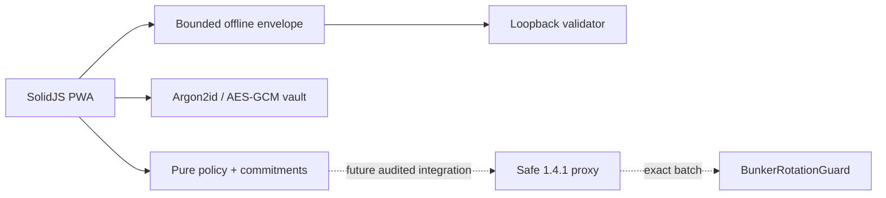

# Architecture

The browser UI is not a trust boundary. `core`, `offline`, and `vault` isolate reviewable logic but compile into the same origin. The intended on-chain path is one pinned `MultiSendCallOnly` delegatecall: an ETH transfer with no calldata followed by the Safe's exact owner swap. The guard is present as reviewable research source, not a deployment artifact.
